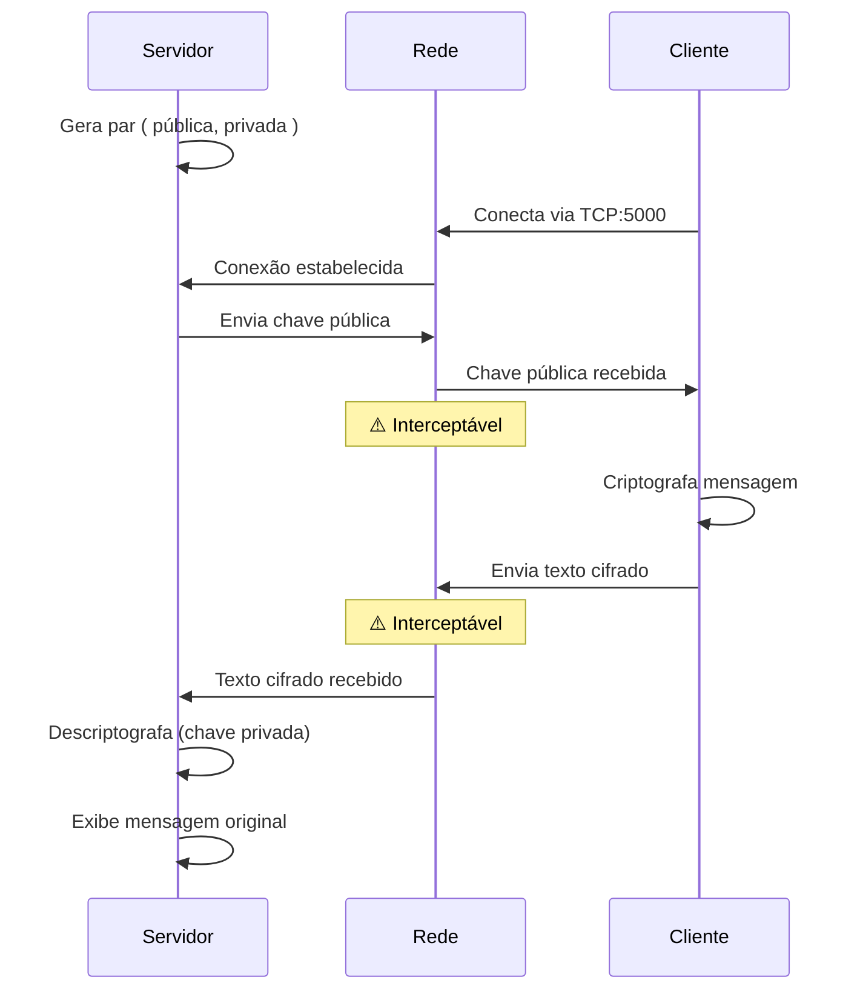

# Sistema Cliente-Servidor com Criptografia RSA

Projeto didático para a disciplina de Segurança de Dados — criptografia assimétrica com RSA 2048 bits.

## Fluxo de comunicação



## Como funciona

1. O **servidor** gera um par de chaves RSA (pública e privada).
2. O **cliente** conecta via TCP na porta 5000.
3. O servidor envia sua **chave pública** ao cliente.
4. O cliente criptografa as mensagens com a chave pública e envia ao servidor.
5. O servidor descriptografa com a chave privada e exibe o texto original.

O sistema suporta **múltiplos clientes** simultaneamente. Cada cliente mantém uma sessão e pode enviar várias mensagens até digitar `sair`.

## Estrutura do Projeto

```
RsaClientServer/
├── ServerApp/          # Aplicação servidor
├── ClientApp/          # Aplicação cliente
├── RsaCrypto/          # Biblioteca de criptografia RSA
├── RsaCrypto.Tests/    # Testes unitários do RsaService
├── NetworkInterceptor/ # Ferramenta de ataque (simula hacker interceptando)
├── RsaClientServer.Web/ # Interface web Blazor (Servidor, Cliente, Interceptor)
├── publicar.bat        # Script para gerar executáveis standalone
└── RELATORIO_ACADEMICO.md
```

## Interface Web

A interface web permite visualizar o sistema inteiro em uma única tela:

```bash
cd RsaClientServer
dotnet run --project RsaClientServer.Web
```

Acesse **http://localhost:5221** e use a página **Ver Demo** para ver Servidor, Cliente e Interceptor lado a lado. Passos: inicie o Servidor, depois o Interceptor e conecte o Cliente em `127.0.0.1:5001`. Ideal para demonstrações em sala.

## Pré-requisitos

- .NET 8 ou .NET 9 SDK

## Como rodar

1. **Inicie o servidor** (em um terminal):
   ```bash
   cd RsaClientServer
   dotnet run --project ServerApp
   ```

2. **Inicie o cliente** (em outro terminal, na mesma pasta):
   ```bash
   dotnet run --project ClientApp
   ```

3. **No cliente**: Quando perguntado, digite o IP do servidor (ou Enter para localhost `127.0.0.1`).

4. **Envie mensagens**: Digite cada mensagem e pressione Enter. O servidor exibirá o texto descriptografado. Digite `sair` para encerrar a sessão.

### Comandos do cliente

| Comando  | Descrição                                               |
|----------|---------------------------------------------------------|
| `sair`   | Encerra a sessão e desconecta                           |
| `ajuda` ou `?` | Exibe os comandos disponíveis                    |
| `info`   | Mostra dados da conexão (IP, porta, limites)            |
| `chave`  | Salva a chave pública em `chave_publica.txt`             |
| `exportar` | Salva a última cifra enviada em `ultima_cifra.txt`    |

### Exemplo de saída

**Servidor:** (com bordas coloridas e timestamp)
```
╔══════════════════════════════════════════╗
║  SERVIDOR RSA - Segurança de Dados      ║
╚══════════════════════════════════════════╝

[OK] Par de chaves RSA gerado (2048 bits)
[OK] Servidor escutando em 0.0.0.0:5000
[...] Aguardando conexões (Ctrl+C para encerrar)...

[OK] [Cliente 1] Conectado de 127.0.0.1:xxxxx
[...] [Cliente 1] Chave pública enviada ao cliente

[Cliente 1] [14:32:15] Olá, esta é uma mensagem secreta!
[...] [Cliente 1] Desconectado
```

**Cliente:** (chave e cifra completas para cópia)
```
╔══════════════════════════════════════════╗
║  CLIENTE RSA - Segurança de Dados       ║
╚══════════════════════════════════════════╝

[1/4] Conectando ao servidor...
[2/4] Conectado ao servidor!
[3/4] Chave pública recebida do servidor.

─── CHAVE PÚBLICA RECEBIDA (interceptável na rede) ───
MIIBIjANBgkqhkiG9w0BAQEFAAOCAQ8AMIIBCgKCAQEA... (chave completa)
─── ───

  Comandos: sair | ajuda ou ?
[4/4] Digite suas mensagens (ou 'sair' para encerrar):

Mensagem: Olá, esta é uma mensagem secreta!
[OK] Mensagem enviada!
Texto cifrado enviado (interceptável na rede): (cifra completa Base64)
Mensagem: sair
```

### Demonstração de ataque (simulação)

Para demonstrar o que um atacante na rede poderia interceptar:

1. **Execute o servidor e o cliente** em máquinas diferentes (ou use localhost).
2. **No cliente**, observe os dados exibidos:
   - **Chave pública**: copie e tente usar em um descriptografador — não será possível descriptografar, pois a chave pública só criptografa.
   - **Texto cifrado**: copie a Base64 de cada mensagem — sem a chave privada, não há como obter o texto original.
3. **Conclusão didática**: Mesmo interceptando chave pública e cifras, o atacante não consegue ler as mensagens. Apenas o servidor (com a chave privada) pode descriptografar.

**Modo debug do servidor** (exibe a chave privada para demonstração):
```bash
dotnet run --project ServerApp -- --debug
```

### Simular ataque (NetworkInterceptor)

Ferramenta de ataque que simula um **hacker** tentando interceptar a comunicação:

1. Inicie o **servidor** (porta 5000)
2. Inicie o **atacante**: `dotnet run --project NetworkInterceptor`
3. Inicie o **cliente** e conecte em **127.0.0.1** porta **5001**
4. O atacante captura chave e mensagens, tenta descriptografar → **falha** (demonstra a segurança do RSA)

## Testar entre computadores diferentes

**No PC do servidor (PC1):**
1. Descubra o IP da máquina (`ipconfig` — procure por "Endereço IPv4", ex: 192.168.1.100).
2. Inicie o servidor (opcional: informe o IP para fazer bind, ou use qualquer interface):
   ```bash
   dotnet run --project ServerApp
   ```
   Para escutar em um IP específico:
   ```bash
   dotnet run --project ServerApp -- 192.168.1.100
   ```
   Para exibir a chave privada (demonstração em sala):
   ```bash
   dotnet run --project ServerApp -- --debug
   ```
3. Libere a porta 5000 no firewall (se necessário).

**No PC do cliente (PC2):**
1. Execute o cliente e, quando solicitado, digite o IP do servidor (ex: `192.168.1.100`).
   ```bash
   dotnet run --project ClientApp
   ```
   O cliente pede o IP interativamente — não usa argumento de linha de comando.

## Gerar executáveis (.exe) sem .NET instalado

Execute na pasta `RsaClientServer`:
```bash
publicar.bat
```

Os executáveis serão gerados em:
- `publish\ServerApp\ServerApp.exe`
- `publish\ClientApp\ClientApp.exe`

Copie as pastas para qualquer PC Windows 64 bits e execute os .exe. O cliente perguntará o IP do servidor ao iniciar.

## Testes

```bash
dotnet test
```

## Limitações

- **Tamanho da mensagem**: Até ~240 caracteres (limite do RSA 2048 com PKCS#1). Para mensagens maiores, seria necessário criptografia híbrida (RSA + AES).
- **Uso didático**: Projeto simplificado para fins educacionais. Em produção, use TLS/SSL.
